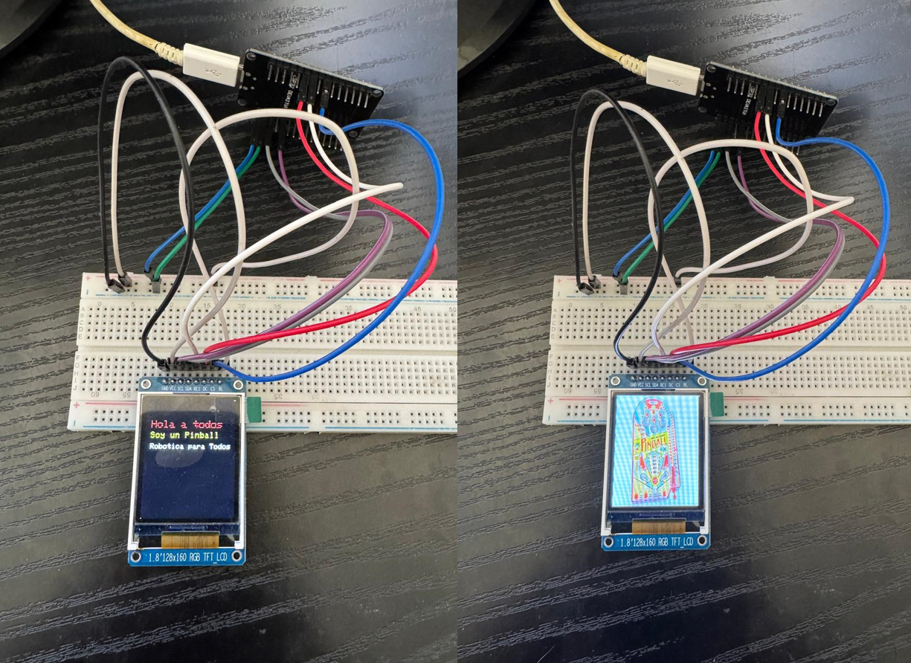

# ESP32 with TFT RGB LCD Screen (128x160 pixels)

## Description
This repository contains an example of how to use a 128x160 pixel TFT RGB LCD screen with an ESP32 using MicroPython. The project demonstrates how to initialize the screen, display text with different sizes and colors, and show BMP images.

This project was created based on the existing repositories of [boochow](https://github.com/boochow/MicroPython-ST7735) and [GuyCarver](https://github.com/GuyCarver/MicroPython/tree/master/lib), adapting their libraries and examples for this specific implementation. We acknowledge and thank both developers for their original work, from which files and reference examples have been taken.

## Requirements
- ESP32 with MicroPython installed
- TFT RGB LCD screen with ST7735 chip (128x160 pixels)
- Correct connections between the ESP32 and the screen

## Repository Contents
- `boot.py`: Main file that runs when the ESP32 starts. It configures the LCD screen and shows examples.
- `tools.py`: Contains utility functions to initialize the screen, display text, and load BMP images.
- `libraries/`: Directory with the necessary libraries:
  - `ST7735.py`: Driver for TFT LCD screens with ST7735 chip.
  - `sysfont.py`: Font definition for displaying text on the screen.
- `images/`: Directory with example images
  - `pinball.bmp`: Example BMP image to display on the screen.

## Hardware Connections
The code is configured to use the following pins on the ESP32:

| LCD Pin | ESP32 Pin |
|---------|-----------|
| CS (Chip Select) | 18 |
| RES (Reset) | 17 |
| DC (Data/Command) | 16 |
| SCK (Clock) | Automatically configured by SPI |
| MOSI (Data) | Automatically configured by SPI |

## Features
- LCD screen initialization
- Screen rotation
- Display text with different sizes and colors
- BMP image visualization

## Usage
1. Load the files onto your ESP32 with MicroPython installed
2. The `boot.py` file will run automatically when the device starts
3. The screen will display a text message and then an image

## Customization
You can modify the `boot.py` file to change:
- The pins used (CS, RES, DC)
- The screen rotation
- The displayed text
- The image to be displayed

## Example
The current example shows:
1. Information about the SPI pins used
2. A text message with "Hola a todos", "Soy un Pinball", and "Robotica para Todos"
3. After 5 seconds, it displays a pinball image

*Note: A Spanish version of this documentation is available in the [README_ES.md](README_ES.md) file.*