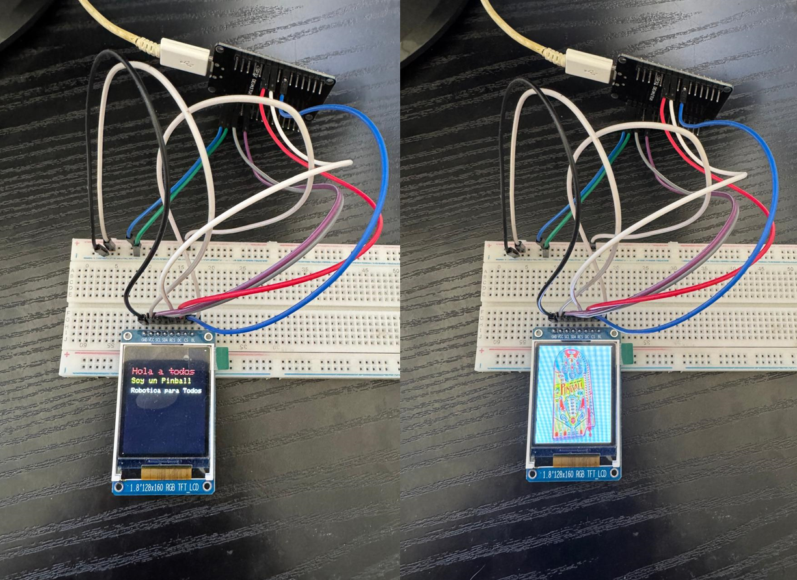

# ESP32 con Pantalla LCD TFT RGB (128x160 píxeles)

## Descripción
Este repositorio contiene un ejemplo de cómo utilizar una pantalla LCD TFT RGB de 128x160 píxeles con un ESP32 utilizando MicroPython. El proyecto demuestra cómo inicializar la pantalla, mostrar texto con diferentes tamaños y colores, y visualizar imágenes BMP.

Este proyecto fue creado a partir de los repositorios ya existentes de [boochow](https://github.com/boochow/MicroPython-ST7735) y [GuyCarver](https://github.com/GuyCarver/MicroPython/tree/master/lib), adaptando sus bibliotecas y ejemplos para esta implementación específica. Se reconoce y agradece a ambos desarrolladores por su trabajo original, del cual se han tomado archivos y ejemplos de referencia.

## Requisitos
- ESP32 con MicroPython instalado
- Pantalla LCD TFT RGB con chip ST7735 (128x160 píxeles)
- Conexiones correctas entre el ESP32 y la pantalla

## Contenido del Repositorio
- `boot.py`: Archivo principal que se ejecuta al iniciar el ESP32. Configura la pantalla LCD y muestra ejemplos.
- `tools.py`: Contiene funciones de utilidad para inicializar la pantalla, mostrar texto y cargar imágenes BMP.
- `libraries/`: Directorio con las bibliotecas necesarias:
  - `ST7735.py`: Controlador para pantallas LCD TFT con chip ST7735.
  - `sysfont.py`: Definición de fuentes para mostrar texto en la pantalla.
- `images/`: Directorio con imágenes de ejemplo
  - `pinball.bmp`: Imagen BMP de ejemplo para mostrar en la pantalla.

## Conexiones de Hardware
El código está configurado para usar los siguientes pines en el ESP32:

| Pin LCD | Pin ESP32 |
|---------|-----------|
| CS (Chip Select) | 18 |
| RES (Reset) | 17 |
| DC (Data/Command) | 16 |
| SCK (Clock) | Configurado automáticamente por SPI |
| MOSI (Data) | Configurado automáticamente por SPI |

## Funcionalidades
- Inicialización de la pantalla LCD
- Rotación de la pantalla
- Mostrar texto con diferentes tamaños y colores
- Visualización de imágenes BMP

## Uso
1. Carga los archivos en tu ESP32 con MicroPython instalado
2. El archivo `boot.py` se ejecutará automáticamente al iniciar el dispositivo
3. La pantalla mostrará un mensaje de texto y luego una imagen

## Personalización
Puedes modificar el archivo `boot.py` para cambiar:
- Los pines utilizados (CS, RES, DC)
- La rotación de la pantalla
- El texto mostrado
- La imagen que se visualiza

## Ejemplo
El ejemplo actual muestra:
1. Información sobre los pines SPI utilizados
2. Un mensaje de texto con "Hola a todos", "Soy un Pinball" y "Robotica para Todos"
3. Después de 5 segundos, muestra una imagen de pinball

*Nota: Una versión en inglés de esta documentación está disponible en el archivo [README.md](README.md).*